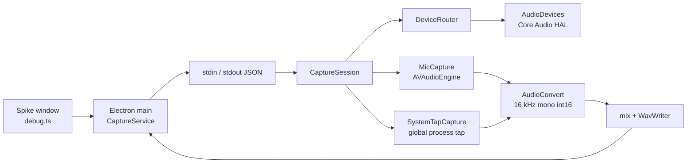

# Capture engine

This report describes the macOS engine that records the microphone and system playback for Pith. It matches the helper in `frontend/native/CaptureHelper` and the Electron path that drives it. The product mix is **16-bit PCM, mono, 16 kHz**.

The engine is audio only. It does not record the screen or video, it does not use ScreenCaptureKit, and it does not install a virtual audio driver.

## 1. What the engine is for

A meeting note needs two streams at once:

- **Microphone.** The person in the room, on the MacBook mic or on whatever headset macOS has made the default input.
- **System audio.** Whatever the Mac is playing: YouTube, Zoom, Meet, Teams, Netflix, and any other app. DRM video stays on screen because nothing captures the display.

Those streams stay separate until Generate. Then they are mixed into one WAV, and the mic-only and system-only WAVs are written beside it. Speech-to-text runs after that, on time slices. A window where both sides are loud uses the mix, so overlap is kept. A window where only one side is loud uses that track.

Already-captured samples survive a Bluetooth connect or disconnect. The hole left while devices are restarted is filled with silence so the two tracks stay aligned in time.

## 2. Where the code lives

| Piece | Path | Role |
| --- | --- | --- |
| Helper process | `frontend/native/CaptureHelper` | Swift executable. Owns Core Audio. |
| Session | `Sources/CaptureSession.swift` | When to record, when to release hardware, Bluetooth handover, mix. |
| Microphone | `Sources/MicCapture.swift` | `AVAudioEngine` pinned to one input UID. |
| System audio | `Sources/SystemTapCapture.swift` | Global Core Audio process tap. |
| Device list | `Sources/AudioDevices.swift` | Read-only defaults, mute state, and stream format. The helper does not change the system defaults or the hardware volume. |
| Route watcher | `Sources/DeviceRouter.swift` | Default UID changes, and sample-rate or channel changes on the same UID. |
| PCM | `Sources/AudioConvert.swift` | Mono mixdown, resample to 16 kHz, headset gain, mix. |
| WAV | `Sources/WavWriter.swift` | Canonical `fmt ` + `data` file. |
| JSON bridge | `Sources/main.swift` | One JSON line per command on stdin, one JSON line per reply or event on stdout. |
| ObjC safety net | `ExceptionCatcher/` | Catches the `NSException` `AVAudioEngine` throws when a tap format is illegal. |
| Build | `frontend/native/build-helper.sh` | `swift build -c release`, wrap as `CaptureHelper.app`, ad-hoc codesign with the audio-input entitlement. |
| Electron | `frontend/src/capture/helper-client.ts`, `native-capture.service.ts` | Spawns the helper and speaks the JSON contract. Helper stderr is copied into the debug log. |
| Slices | `frontend/src/capture/segment-tracks.ts` | After Generate, labels each 0.2 s window `mic`, `system`, or `mix`. |
| Debug log | `frontend/src/debug/session-trace.ts` | Temporary file written after Generate. Collects helper, frontend, and backend lines. |
| New note UI | `frontend/src/renderer/debug.ts`, `frontend/src/main.ts` | **+ New note** is what opens the hardware. |

The renderer never talks to Core Audio. It calls `CaptureService` in the Electron main process. That process owns the helper.

## 3. Libraries and system APIs

There is no third-party audio library. The helper links only Apple frameworks.

| API | Used for |
| --- | --- |
| **AVFoundation / AVAudioEngine** | Microphone. One engine, input node pinned to a device id, tap on bus 0. |
| **AVAudioConverter** | Resample to 16 kHz. One persistent converter per source. Linear interpolation only if that converter errors. |
| **Core Audio HAL** | Device list, default input, default output, transport type, mute state, stream format. |
| **AudioToolbox** | `AudioHardwareCreateProcessTap`, `AudioHardwareCreateAggregateDevice`, `AudioDeviceStart`, `AudioUnitSetProperty`. |
| **CATapDescription** | `stereoGlobalTapButExcludeProcesses`. macOS 14.2+. |
| **CoreGraphics** | `CGRequestScreenCaptureAccess()`. This is the Screen Recording permission prompt the process tap needs. It does not start a screen capture. |
| **AppKit** | `NSApplication` with `.accessory` so the helper can show the permission dialogs without a Dock icon. |
| **Foundation** | JSON, locks, temp files, timers. |
| **ExceptionCatcher (Objective-C)** | `@try/@catch` around `installTap`. Swift `do/catch` does not see that exception. |

Electron uses Node `child_process.spawn` with stdin and stdout pipes. No native Node addon.

The helper is signed with `com.apple.security.device.audio-input`. System audio also needs the user to allow **Screen & System Audio Recording** for Electron or Pith Capture Helper. Microphone permission is requested with `AVAudioApplication.requestRecordPermission()` the first time hardware opens.

## 4. Architecture

`CaptureSession` is the only place that decides policy: start, pause, stop, cancel, and what a route change means. `MicCapture`, `SystemTapCapture`, and `DeviceRouter` are swappable behind protocols (`MicrophoneCapturing`, `SystemAudioCapturing`, `DeviceRouting`). The session is constructed with the real types in `CaptureSession.init()`.

One `SerialGate` runs preview, start, stop, cancel, and Bluetooth handover. Those operations never overlap. A second route event that arrives during a handover sets `dirtyRoute`. When the current pass finishes, the loop reads the latest devices and runs again, up to three passes.

Audio callbacks do not take that gate and do not convert. They copy mono float samples and a host timestamp, then return. Conversion, headset gain, and appending run on `dev.pith.audio.process`. If that queue already holds 48 buffers, the new one is dropped and `droppedAudio` increases. `stop()` sets `stopRequested`, waits until that queue is empty, then under the lock pads both tracks to the stop host time and copies them into `frozenMic` and `frozenSystem`. Later callbacks see `frozen` and return. The gate then releases the hardware and writes the WAVs, so Generate cannot lose the tail of the recording and cannot race a handover.

## 5. JSON contract

`main.swift` reads `{ "id", "cmd" }` and writes `{ "id", "ok", ... }`. Commands are fixed:

| Command | What the session does |
| --- | --- |
| `preview` | Open the mic and the system tap if a note is not already running. Leave `recording` false, so samples are measured and then dropped. |
| `start` | Mark the note as listening and keep samples. Open hardware only if it is not already open. |
| `pause` | Stop appending. Hardware stays open. Levels go to zero. |
| `resume` | Append again. The silence during pause is a gap that gets padded on the next buffer. |
| `stop` | Freeze the PCM, release hardware, write WAVs, return the file paths. |
| `cancel` | Drop the buffers and release hardware if it was open. |
| `state` | `"idle"`, `"listening"`, or `"paused"`. |

Events, written any time, not as replies:

- `levels` `{ mic, system }` each in `0...1`, about every 50 ms.
- `device` `{ inputName, lost }`. `lost` is true when the input name is empty.

Stderr is a human log (`CaptureLog`). It is not part of the JSON contract.

## 6. Taking and releasing the hardware

Hardware means three things together: the `AVAudioEngine` on the microphone, the global process tap, and the device router. `hardwareOn` is true only after all three have been started.

The notepad does **not** open them. They stay off until **+ New note**.

### 6.1 New note opens them

1. `shell:openSpike` in `main.ts` calls `cancel`. On the notepad the helper is idle, so this logs `capture cancelled; hardware idle` and does not touch Core Audio.
2. The spike page loads. `debug.ts` calls `start` directly, so the first buffers are part of the recording.
3. `start` sets `recording = true` and a host-time origin, then `openHardware`:
   - Request microphone permission if this is the first open.
   - Call `CGRequestScreenCaptureAccess()` again so a tap started after a later grant is allowed. The first prompt is at Electron launch and does not open the mic or the tap. `Info.plist` also has `NSAudioCaptureUsageDescription` for the system-audio capture prompt.
   - Start the microphone and the system tap at the same time. Each has its own retries. A slow or failing mic does not hold system audio behind it.
   - Microphone: up to 4 attempts, 400 ms apart, 5 second timeout per attempt. A timed-out start cannot publish the engine afterward; the generation token rejects it.
   - System tap: up to 4 attempts, 350 ms apart.
   - Start the 50 ms level timer and the device router.
4. Buffers that arrive while the devices are starting are converted off the audio thread and kept. Silence is inserted from the recording origin to the first host timestamp, so the two tracks share one timeline.

Creating the process tap is what briefly interrupts playback. That interruption happens when New note is pressed, because that is when the tap is created. The first moments of the meeting can fall in the gap before the tap and the mic are both delivering buffers.

### 6.2 Pause and resume leave them open

Pause only flips `paused`. The engine and the tap keep running, so Resume does not rebuild the audio graph and does not cut playback again. Samples during pause are discarded. The next kept buffer pads the hole with zeros so the timeline stays continuous.

### 6.3 Generate releases them before any file is written

`stop()` runs in four steps.

1. Set `stopRequested`.
2. Wait until the audio process queue has finished the buffers already copied.
3. Under the lock, pad both tracks to the current host time, copy them into `frozenMic` and `frozenSystem`, and set `frozen`. Later callbacks return immediately, so nothing is appended after the click.
4. On the gate, `finish()` uses those frozen arrays, then `closeHardware()`, then mixes and writes the WAVs.

`closeHardware` order:

1. Stop the device router so a route change cannot start a handover.
2. Stop the level timer.
3. Stop the system tap: `AudioDeviceStop`, destroy the IO proc, destroy the aggregate device, destroy the process tap.
4. Stop the microphone. `MicCapture.stop()` bumps a generation counter so any callback already in flight is ignored, then removes the tap and stops the engine on a background queue. The HAL stop is not allowed to block the session.
5. Clear converter caches, `hardwareOn`, and the bound input and output UIDs.

The log line `capture stopped; hardware released before transcribe` is written after that and before `WavWriter`. Electron then reads the files and calls `POST /spike/transcribe`. The mic indicator and **Speaker Audio Recorder** should drop before the network call starts.

If the mix is empty or shorter than 0.5 seconds, the buffers are cleared, `stopRequested` is cleared, and the helper returns `empty` or `too_short`. Hardware is already released.

### 6.4 Home, Move to trash, and a new note from the notepad

`cancel` drops the session, deletes temp WAVs, and clears the PCM. If `hardwareOn` is true it calls the same `closeHardware`. If the helper was already idle it does not call into Core Audio.

Home (`shell:openNotepad`) and Move to trash both cancel. A new **+ New note** also cancels first, which is a no-op when the notepad has already released the hardware, and then the spike page opens it again.

Quitting the app calls `capture.dispose()`, which cancels and then kills the helper process. Any device the helper still held is released when the process exits.

### 6.5 What “control” means

The helper does not exclusively lock the microphone. macOS still owns the default device. The helper:

- Opens the input with `AVAudioEngine` and pins that engine to a device id (`kAudioOutputUnitProperty_CurrentDevice`).
- For a Bluetooth input, logs whether the hardware mute is on. It does not unmute the device and it does not set the hardware volume. Quiet headset speech is boosted in software only.
- Leaves voice processing off. Turning it on forces many headsets into the phone profile and drops high-quality playback.
- Installs a private global process tap. macOS shows that as **Speaker Audio Recorder** in the sound menu while the tap exists. That row is the system reporting a capture, not a speaker the user should select. Playback should stay on the headphones or the Mac speakers.

The tap is never given an output-device UID. Binding a process tap to the speaker UID is what steals the default output and mutes YouTube, Netflix, and Meet. The aggregate device is private (`kAudioAggregateDeviceIsPrivateKey`) and is not stacked onto the user’s output.

## 7. Microphone strategy

`MicCapture.start` builds a new `AVAudioEngine` every time the input UID changes.

1. Log the hardware mute state. Do not change it.
2. Disable voice processing.
3. Pin the input audio unit to the device id. Pin again after `prepare()` unless the unit is already initialized (`kAudioUnitErr_Initialized`).
4. Start the engine once, only to read formats.
5. Log both formats: `inputFormat` (what the hardware offers) and `outputFormat` (what the engine graph actually produces).
6. Choose a tap format. Prefer `outputFormat` when it is linear PCM with a real sample rate and channel count. Otherwise build 32-bit float, non-interleaved, at the hardware rate. AirPods in headset mode report 24 kHz on the hardware format. Passing that raw format to `installTap` makes Core Audio throw **-10868** (`kAudioUnitErr_FormatNotSupported`) and, if uncaught, kills the helper.
7. Stop the engine, pin again, install the tap inside `PithCatchException`. An `NSException` becomes a Swift error, `mic_tap ...`, and the session retries. It does not exit.
8. Start the engine for real.

The tap callback checks a generation token. `stop()` increments the token and drops the engine pointer before the asynchronous HAL stop, so a buffer from the old device cannot be appended after a switch, and a start that loses the race does not install that engine. `AVAudioEngineConfigurationChange` reinstalls the mic on the same UID when the engine reports a new format. Notifications from our own start are ignored for one second.

Headset microphones are quiet. `HeadsetMicGain` runs only when `inputBluetooth` is true. It aims near a peak of 8000 and will not multiply by more than 16. Built-in and USB inputs are stored unchanged. The gain resets whenever the bound input changes.

If all 4 attempts fail, the session logs `mic start gave up`, publishes an empty device name (`lost: true`), and still tries to start the system tap. A missing mic does not block system audio.

## 8. System-audio strategy

`SystemTapCapture.start` always stops any previous tap first, then:

1. Resolve this process to a Core Audio process object and exclude it, so the helper does not record itself.
2. Create a `CATapDescription` with `stereoGlobalTapButExcludeProcesses`. Name `Pith System Audio`, `isPrivate = true`, `muteBehavior = .unmuted`.
3. `AudioHardwareCreateProcessTap`. Status 0 with tap id 0 (`kAudioObjectUnknown`) is a failure, not success. The session retries.
4. Create a private aggregate device whose only sub-tap is that process tap, with drift compensation. UID `dev.pith.tap.<uuid>`. The aggregate is not set as the default output.
5. Read the aggregate’s input stream format and install an IO proc with `AudioDeviceCreateIOProcIDWithBlock`.
6. `AudioDeviceStart`.

Each callback copies the `AudioBufferList` into an `AVAudioPCMBuffer` and hands it to the session. The copy happens on the Core Audio IO thread (`dev.pith.system-audio.io`); the session lock is taken only inside `append`.

The tap is global. It hears process audio regardless of which speaker is selected. It is still destroyed and created again when the **output UID** changes. A running process tap can pin playback to the previous output. Releasing it is what lets sound follow the headphones or the Mac speakers. The new tap is also global. It is not bound to the new UID.

If all 4 attempts fail, `systemAudioEnabled` stays false and the note continues mic-only. The UI can still show levels for the mic.

`start()` logs `bindUID=global` and the name of the current default output. That name is only a label in the log. It is not passed to the tap.

## 9. From device buffers to a WAV

Each callback copies the buffer with `AudioConvert.copyMono` and returns. `AudioConvert.int16Mono16k` runs later, on the process queue:

1. The copy already mixed channels down to mono float. Interleaved and non-interleaved layouts are both accepted. Integer 16-bit sources are accepted too.
2. If the rate is already 16 kHz, scale to int16.
3. Otherwise one persistent `AVAudioConverter` per source converts to 16 kHz. The mic and the system audio do not share a converter. 48 kHz and 24 kHz both use this path. Each buffer is fed with `.haveData` once and then `.noDataNow`. The converter is not reset on success. Resetting it on every buffer, or ending the stream on every buffer, garbles 24 kHz headset speech.
4. An error falls back to linear interpolation for that buffer and calls `reset()` on the converter. A zero-length success is converter priming and is not a failure.

Bluetooth input then passes through `HeadsetMicGain`. Samples are stored only when `recording` or `noteActive` is true, and not when paused or frozen.

A gap is silence only when the host time between buffers is longer than the audio they contain, by more than 20 ms. Host time comes from `mach_absolute_time` at the start of the note, from `AVAudioTime.hostTime` on the mic, and from the IO proc timestamp on the system tap. A callback that is delivered late, but whose timestamps are continuous, is not padded. Gaps of 200 ms or more are logged as `pad mic` or `pad system`. A hole longer than 300 seconds is not padded. Stop flushes the process queue, then pads each track up to the stop host time, so a hole at the end is not lost. The first buffer on each track logs `first mic latencyMs` or `first system latencyMs` from the recording origin.

On stop, `AudioConvert.mix` adds the two int16 tracks sample by sample. If that sum would fall outside int16, that sample is halved. Otherwise the sum is kept. The longer track defines the length. `WavWriter` writes a canonical WAV: `RIFF` / `WAVE` / `fmt ` (16-byte PCM) / `data`. No `JUNK` chunk. Three files when both tracks have samples:

- `pith-<uuid>-mix.wav`
- `pith-<uuid>-mic.wav`
- `pith-<uuid>-sys.wav`

They live in the user temp directory. Electron reads them and deletes them after the spike upload.

## 10. Bluetooth connect and disconnect

The router does not look for the name “AirPods”. Any device whose transport is Bluetooth or Bluetooth LE is treated the same way. Identity is the Core Audio UID, for example `40-ED-CF-DC-ED-A8:input` and `40-ED-CF-DC-ED-A8:output`.

### 10.1 What counts as a change

`DeviceRouter` listens to three HAL properties:

- `kAudioHardwarePropertyDefaultInputDevice`
- `kAudioHardwarePropertyDefaultOutputDevice`
- `kAudioHardwarePropertyDevices`

Callbacks are debounced by **0.6 seconds**. A poll every **2 seconds** catches a change the callback missed. A change is emitted when the default **input UID** or **output UID** differs, or when the same UID changes sample rate or channel count. A format change recovers that source. It is not treated as a different device.

`suppress(for:)` ignores those checks until a deadline. Later calls only extend the deadline. They do not shorten it. The session suppresses for 0.8 seconds after a mic start and after a handover so its own graph changes do not look like the user plugging something in. It does not write the system default input or output.

### 10.2 Handover

`reconcile` runs on the serial gate. It loops at most three times so a second change during the first pass is applied to the latest UIDs.

`reconcile` does not trust the event as the desired device. It reads a fresh snapshot and compares that with the running UIDs and sample rates. Up to three passes, if another change arrives mid-recovery.

1. **Input UID or input sample rate changed.** Stop the mic, drop its converter, and start it on the current default input. If that input is missing, keep the mic that is already running.
2. **Output UID unchanged and the mic did not move.** Leave the microphone alone.
3. **Output UID or output sample rate changed, or a Bluetooth mic just opened, or the tap is down.** Stop the process tap, drop its converter, wait 150 ms, and start one new global tap. Opening a headset mic can stall an older tap, so that one case recreates the tap even when the output UID is unchanged. The new tap is still not bound to a speaker.
4. Remember the fresh snapshot and suppress route events for 0.8 seconds.

Samples already in `micSamples` and `systemSamples` are not cleared. The 150 ms and 100 ms sleeps become silence pads on the next buffer.

### 10.3 A real disconnect

When the headset leaves the default devices, the fresh snapshot names the MacBook microphone (or whatever macOS selected). The mic is rebound to that UID. The tap is recreated once, still global, so playback through the built-in speakers is captured. The helper does not set the defaults back.

`preferredInput()` returns the current default input. It returns the built-in mic only when the default input is missing or is an output-only UID. It does not replace a live Bluetooth default with the MacBook mic.

### 10.4 Same-device format changes

A Bluetooth headset can switch between 24 kHz and 48 kHz without changing its UID. The router emits `input format` or `output format` in that case. The mic side also listens for `AVAudioEngineConfigurationChange`, because the engine can stop itself when the I/O format changes. Recovery reinstalls only the affected source and compares the new rate with the rate already running, so an unchanged configuration does not restart.

The helper no longer writes `kAudioHardwarePropertyDefaultInputDevice` or `kAudioHardwarePropertyDefaultOutputDevice`. A snap back to the built-in devices is treated as macOS's current choice. Device-list presence alone is not used to undo it.

### 10.5 What the session will not do

- It will not wait for stereo or for the music profile before starting the mic or the tap. Waiting produced a process tap with id 0 and a long hole.
- It will not run a heartbeat that recreates the tap whenever the level is low. Speech pauses and quiet YouTube passages look like a dead tap, and that loop bounced the route onto the wrong device.
- It pins the microphone to the fresh default input at recovery time, not to an older event that has already been superseded. Output selection stays with macOS.
- It will not start a second tap while the first handover is still inside the gate.

## 11. Levels, device name, and the clock

The level timer reads the last mic and system RMS. A side is zero if its last buffer is older than 150 ms. RMS below 0.004 is silence. The value sent to the UI is clamped to `0...1`.

The device event carries the input name from the device the mic was actually started on. The spike window shows that name and, when it is empty, the mic-lost warning.

The on-screen clock is in the renderer, not in the helper. It starts on the first non-silent level. Stop pauses it immediately. Generate freezes it on click and leaves it frozen if transcription fails.

## 12. Permissions and packaging

| Permission | When | Why |
| --- | --- | --- |
| Microphone | First `openHardware` asks on the main thread so the system dialog can appear. Electron also asks when it is ready. If macOS already denied it, **+ New note** opens System Settings → Microphone and does not show an error in the note. | `AVAudioEngine` input. |
| Screen & System Audio Recording | `CGRequestScreenCaptureAccess()` when Electron is ready, from a helper process that exits without opening devices. `openHardware` calls it again when a note starts. | The process tap is gated by this TCC prompt. The launch call does not open the mic or the tap. Denying it leaves the note mic-only. |
| Entitlement `com.apple.security.device.audio-input` | Ad-hoc signature in `build-helper.sh` | The helper binary is allowed to open an input device. |

`npm start` in `frontend` runs `build-helper.sh` and then Electron. A helper that is already running keeps the old binary until the app is fully quit and started again.

While you run from the terminal, the permission list usually shows **Electron**. A packaged build shows **Pith Capture Helper** or **Pith**.

## 13. Failure behavior

| Failure | Result |
| --- | --- |
| Microphone permission denied | `preview` / `start` throws `mic_denied`. Hardware is not left half-open by a successful `openHardware`. |
| Mic start throws, including `mic_tap` after -10868 | Up to 4 attempts, then mic-lost. System tap still starts. |
| Mic start exceeds 5 seconds | `mic_start_timeout`, same retry path. |
| Process tap or aggregate fails | Up to 4 attempts, then `system audio unavailable after retries`. The note continues with the mic. |
| `stop` with no audio | `empty`. |
| `stop` under 0.5 seconds | `too_short`. Electron also enforces `minListenSeconds` from `GET /config` before transcription. |
| Helper process crashes | Electron rejects the pending command with `helper_exit`. The next command spawns a new process. |
| `pause` when not listening, `resume` when not paused | `not_listening`, `not_paused`. |

## 14. Limits of this strategy

- The process tap has to be created when a note starts and destroyed when the note ends. Creating it can interrupt playback for a short time. Keeping it alive on the notepad would avoid that cut and would leave the microphone and **Speaker Audio Recorder** on while no note is open. The current choice is to pay the cut on **+ New note** and again when leaving a note.
- The helper follows macOS when the default devices move. It will not force a headset back if macOS or the user selects the built-in devices while the headset is still paired.
- Opening a Bluetooth headset microphone can itself drop the headset into a lower-quality mode. Leaving voice processing off does not prevent that. A desk setup that wants the Mac microphone with headphone playback depends on macOS keeping the Mac microphone as the default input.
- The global tap hears process audio. It does not hear audio that never enters the Mac, such as sound that stays inside a Bluetooth device.
- Voice processing stays off, so the engine does not cancel echo between the speakers and the mic. The mix can contain both the remote person and the room.
- Transcription runs once, after Generate, on the finished slices. A live transcript while the note is still recording is not part of this engine. See section 16.
- The temporary debug log in section 15 is for bug reports. It is not a product feature.

## 15. After Generate: slices and the temporary debug log

Generate stops capture and releases the hardware before any transcription request. Electron reads the three WAVs and deletes them. `segmentTracks` walks the mic and system tracks in 0.2 second windows:

- Both peaks are at least 500: the slice source is `mix`, so speech on both sides is kept even if one side is louder.
- Only one side reaches 500, and it is at least twice the other: the slice source is that track, `mic` or `system`.
- Otherwise the slice uses the louder side. Windows under 500 on both sides are silence and are not sent.

Each slice is posted to `POST /spike/transcribe`. The spoken text is joined in time order and written into the notes field. The terminals still print the same lines they printed before (`spike segment … source=`, `stt start`, `stt done`).

### Temporary debug log

After that attempt, including a failure and a note that is too short, Electron writes one file:

`frontend/debug-logs/capture-<time>.log`

The folder is gitignored. The file is only for explaining a bug or an unexpected route. The frontend terminal prints `debug log` and the path. The buffer starts again on **+ New note**, Home, and Move to trash.

| Section | What it contains |
| --- | --- |
| Audio sources | Each slice: time range, `source=mic`, `source=system`, or `source=mix`, peak, and, when speech-to-text returned, language, character count, and preview. |
| Devices | Helper lines for Bluetooth connect and disconnect, route changes, mic format, and the system tap. |
| Helper | Helper stderr from `CaptureLog`: permission, mic and tap start, first-buffer latency, pads, dropped buffers, handover, and `capture stopped; hardware released before transcribe`. |
| Frontend | Electron lines such as `spike files`, `spike segment`, and `capture stopped; transcribing`. |
| Backend | Spike and speech-to-text lines from that request (`spike wav`, `stt start`, `stt done`, and the cost line). The spike handler returns those lines with the transcript so they sit in the same file as the helper log. |

## 16. Left for later

**Live transcript.** Speech-to-text does not run while the meeting is still being recorded. The note does not fill in words as people speak. A live transcript is a later step. It is not part of the helper, the JSON contract, the clock, or the debug log.

The product upload `POST /notes/:id/stop` is also later. It uses the same WAV format. `POST /spike/transcribe` stays a development-only route.
